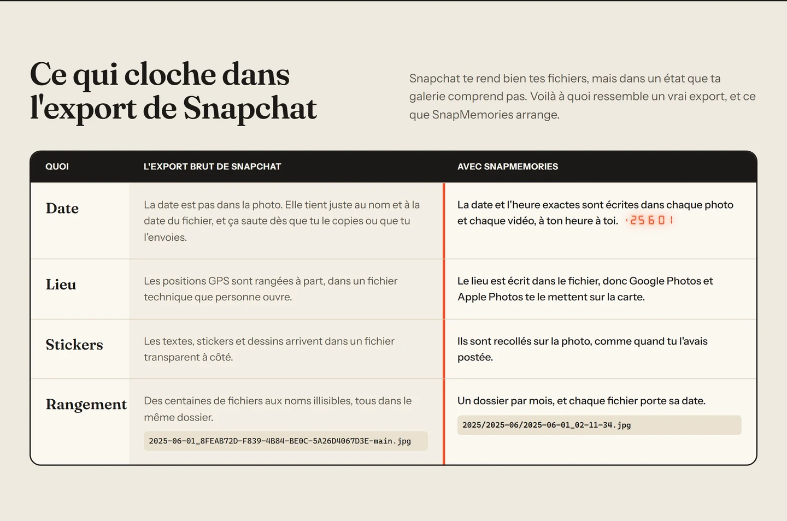
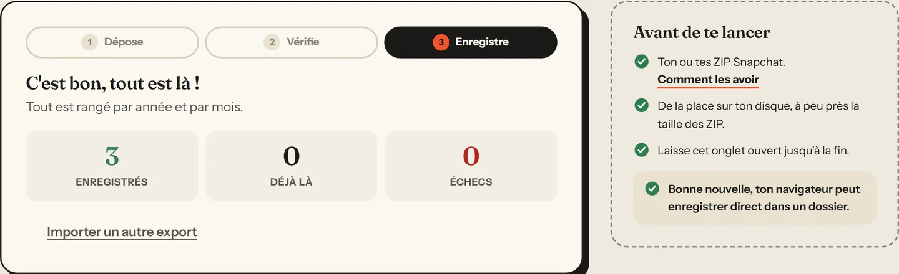

<div align="center">


# SnapMemories

Récupère tous tes Souvenirs Snapchat sur ton ordi, avec leur vraie date, leur lieu et leurs stickers.

[](https://memories.qyrn.dev/fr/)
[](LICENSE)

<br />

<a href="https://memories.qyrn.dev/fr/#tuto"></a>

<sub>Le tuto en 51 secondes, sur la vraie page de Snapchat. Avec le son, c'est sur <a href="https://memories.qyrn.dev/fr/#tuto">le site</a>.</sub>

</div>

<br />

Sans abonnement, Snapchat te laisse plus accès qu'à ta dernière année de Souvenirs et à tes 5 premiers Go. Pour garder le reste, faut tout exporter. Le souci, c'est que l'export arrive en vrac : pas de date dans les photos, pas de lieu, les stickers à part.

SnapMemories remet tout ça en ordre. Tu déposes tes ZIP sur [memories.qyrn.dev](https://memories.qyrn.dev/fr/) et tu récupères une vraie photothèque. Pas de compte, rien à installer, et tes fichiers quittent jamais ton navigateur.

## 👀 Ce que ça change

<div align="center">

</div>

- **La date** est écrite dans chaque photo et chaque vidéo, à ton heure à toi. Google Photos, Apple Photos et Windows les mettent enfin au bon endroit dans le temps.
- **Le lieu** est écrit dans le fichier, donc tes Souvenirs apparaissent sur la carte.
- **Les stickers**, textes et dessins sont recollés sur la photo, comme quand tu l'avais postée. Pour les vidéos, ils sont gardés à côté dans un fichier séparé.
- **Le rangement** : un dossier par mois, et chaque fichier porte sa date, genre `2025/2025-06/2025-06-01_02-11-34.jpg`.
- **Plusieurs ZIP** ? Dépose-les tous d'un coup, SnapMemories les lit ensemble.

## 📥 Comment faire

1. Va sur [accounts.snapchat.com](https://accounts.snapchat.com/v2/download-my-data), connecte-toi et ouvre « Mes données ».
2. Active « Exporter mes souvenirs », puis clique sur « Demander uniquement des souvenirs ».
3. Attends le mail de Snapchat (quelques minutes à quelques heures), puis « Voir les exports » et « Télécharger » pour chaque ZIP.
4. Ouvre [memories.qyrn.dev](https://memories.qyrn.dev/fr/) et dépose tous les ZIP dans le cadre.
5. Choisis un dossier, genre dans tes Images. Ça démarre direct.

<div align="center">

</div>

> [!WARNING]
> Les exports Snapchat expirent au bout de 3 jours, et t'as droit qu'à une demande toutes les 72 heures. Télécharge tes ZIP sans traîner.

> [!NOTE]
> Chrome et Edge sur ordi enregistrent direct dans un dossier. Firefox et Safari te donnent des fichiers ZIP de 1 Go max, à dézipper ensuite. Sur téléphone, ça marche pour les petits exports.

Si ça s'arrête en plein milieu, relance avec le même dossier : ce qui est déjà enregistré est sauté, donc pas de doublons.

## 🔒 Et tes données ?

Tout se passe dans ton navigateur. La page lit tes ZIP dans l'onglet et écrit le résultat sur ton disque. Y'a aucun serveur à moi derrière, aucun outil de stats, et même les polices sont servies par le site lui-même. Le code est là, tu peux vérifier.

Une photo sans sticker reste intacte : y'a juste la date et le lieu qui sont ajoutés dedans. Celles avec stickers sont réenregistrées en haute qualité pour les coller.

## 🤔 Si ça coince

<details>
<summary><b>Je trouve pas « Demander uniquement des souvenirs »</b></summary>
<br />
Active d'abord « Exporter mes souvenirs », le bouton bleu apparaît juste en dessous.
</details>

<details>
<summary><b>« Pas trouvés dans ces fichiers »</b></summary>
<br />
Snapchat t'a sûrement envoyé plusieurs ZIP. Dépose-les tous en même temps, pas un par un.
</details>

<details>
<summary><b>« Dispo seulement en lien »</b></summary>
<br />
Les vieux exports contenaient juste des liens de téléchargement au lieu des fichiers. Refais un export sur Snapchat avec « Demander uniquement des souvenirs », les fichiers seront dedans.
</details>

<details>
<summary><b>Comment je les mets dans Google Photos ou iCloud ?</b></summary>
<br />
Importe juste le dossier que t'as obtenu. La date et le lieu sont lus tout seuls.
</details>

## 💬 Un bug, une idée ?

Un truc qui casse ou qui te manque ? [Signale un bug](../../issues/new?template=bug.yml) ou [propose une idée](../../issues/new?template=idea.yml), un petit formulaire te guide. Pas de compte GitHub ? Écris à [contact@qyrn.dev](mailto:contact@qyrn.dev?subject=SnapMemories). N'envoie jamais tes ZIP, ils contiennent tes photos.

---

<details>
<summary>🛠️ <b>Pour bidouiller le code</b></summary>

<br />

Vite et TypeScript strict, sans framework. Il faut Node 24+ et pnpm 10+. Tout est dans `web/`, le site est déployé sur Vercel à chaque push.

```bash
pnpm --dir web install
pnpm --dir web dev          # le site en local, rechargé à chaque modif
pnpm --dir web typecheck
pnpm --dir web test         # tests unitaires (Vitest)
pnpm --dir web e2e          # tests de bout en bout (Playwright)
web/node_modules/.bin/biome check .
pnpm --dir web build        # génère web/dist
pnpm --dir web assets       # régénère les icônes et les images de partage depuis web/build/logo.svg
```

Les pages anglaise et française sont générées au build depuis `web/src/page.html` et `web/src/ui/strings.ts`.

Le tuto vidéo est un film animé rendu image par image depuis `web/film/` : une reconstitution de la page Snapchat et du site, avec le curseur, les mouvements de caméra et le son synthétisé. Pour le voir en direct puis le rendre dans les deux langues (il faut un binaire ffmpeg) :

```bash
pnpm --dir web film                       # aperçu sur http://localhost:4174/?lang=fr&play
pnpm --dir web film-build && pnpm --dir web film-preview
FFMPEG=/chemin/vers/ffmpeg pnpm --dir web film-render
```

| Dossier          | Rôle                                                                    |
| ---------------- | ----------------------------------------------------------------------- |
| `web/src/export` | lecture des ZIP et de la liste des souvenirs, association des fichiers  |
| `web/src/media`  | écriture de la date et du lieu dans les JPEG (EXIF) et les MP4          |
| `web/src/import` | le déroulé de l'import, fichier par fichier                             |
| `web/src/output` | écriture dans un dossier ou dans des ZIP, suivi de ce qui est déjà fait |
| `web/src/ui`     | l'interface, les textes en anglais et en français                       |
| `web/film`       | le film du tuto                                                         |
| `web/build`      | génération des pages, des icônes et rendu du film                       |

</details>

<br />

Sous [licence MIT](LICENSE). Fait par [qyrn](https://github.com/qyrn), sans lien avec Snap Inc. Si SnapMemories te rend service, tu peux passer dire merci sur [Ko-fi](https://ko-fi.com/qyrnsec).
